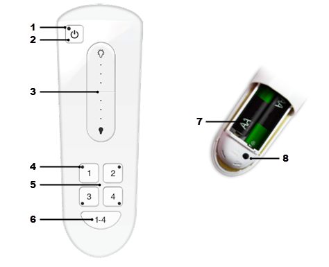

# Remote Control Components {#ref_remote_control_components .reference}

The remote control has components that allow you to program and operate the light bulbs on your lighting network.

|\#|Component|Description|
|--|---------|-----------|
|1|Power button indicator|Indicator that lights or flashes during different activities with the remote control. Indicators include:-   Green: Power on/off or dimmer command was successfully sent to the selected lighting group\(s\).
-   Red: Power on/off or dimmer command failed. Indicator remains red for 3 seconds.
-   Amber: Batteries are running low. Indicator flashes amber periodically.

|
|2|Power button|Button that you press to turn on or off the lights in the selected lighting group\(s\). Lights turn on to the previous dimming level.**Note:** To turn on/off all network lights, regardless of lighting group, press and hold the power button for 3 seconds without first pressing the lighting group number button.

|
|3|Dimmer control|Control that you press and hold to dim or brighten the lights in the selected lighting group\(s\). You do not have to press the power button first.|
|4|Lighting group number indicator|Indicator that lights or flashes during different activities with the corresponding lighting group. Indicators include:-   Green: Selected lighting group is activated for you to turn on/off, dim, or program. The lighting group remains activated \(indicator remains green\) for 5 seconds if you take no subsequent action.
-   Red: Lighting group was not activated for you to take action. Indicator remains red for 3 seconds.

|
|5|Group number button|Buttons that you press to select a corresponding lighting group to operate. Also use these buttons to program lights into the lighting group.CAUTION:

Do not press and hold for longer than 4 seconds unless you are programming a lighting group.

|
|6|All group numbers|Button that you press to select all lighting groups to operate at the same time.|
|7|Battery compartment|Compartment on the back that holds 2 AA batteries to power the remote control. When batteries run low, the indicator light on the power button periodically flashes amber.|
|8|Reset button|Button that you press to manage the remote control as follows:-   Press and release 3 times to connect the remote control to a lighting network that already exists \(for example, if you are replacing a remote control\).
-   Press and hold for 10 seconds to reset the remote control and all lighting group programming on it.

**Warning:** If you reset the remote control, you must reprogram all lighting groups on it.

|

