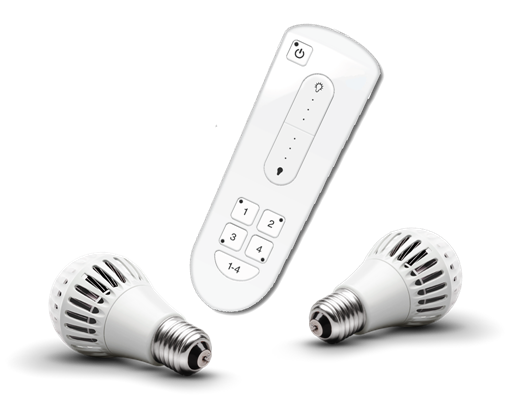

# Remote Network Lighting Overview {.concept}

Remote lighting allows you to operate network-based home lighting through a remote control.

The [product-name] kit includes a wireless smart lighting system that helps make the lighting in your home more energy efficient and easier to manage. The kit includes the following components:

-   Remote control: Allows you to power on, power off, and dim groups of lights on your network.
-   LED light bulbs: Energy-efficient network light bulbs you can install into standard light fixtures.

{{ site.data.conrefs.phrases.good }}

